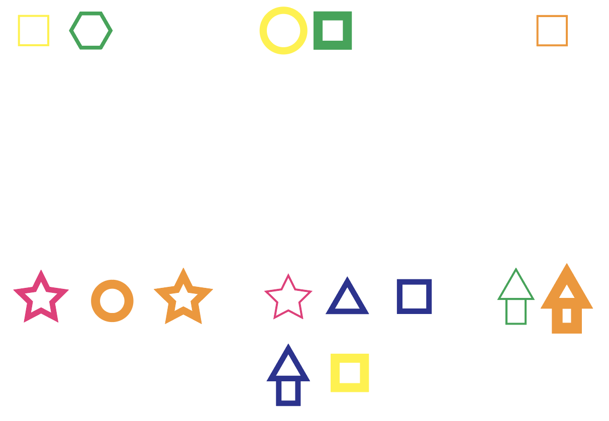

# week 1

## intro

We started off with an intro into generative and parametric design. There were some particular examples by Ryoji Ikeda with [Test Pattern](https://www.youtube.com/watch?v=XwjlYpJCBgk) and David Klein with [No Regrets](http://davidjklein.ca/No-Regrets)(site is no longer accessible) that really sparked my interest. 'No Regrets' is a typographic web page with some parts of the text acting as minute and hour hands of a clock. This means that when you first load up the page, you can read the text perfectly but if you left it for a number of hours it would become illegible. This also reminded me of a page from last semester by Tiger Dingsun called [Reading Machines](https://tdingsun.github.io/reading-machines/) that incorporated typography as well as poetry and other literature with sound and a some clever web-coding. From looking at these examples and a few more I got the idea that a web-based project might be a good idea, seeing as everyone would be able to access it, and I had never worked on a web project before. I also liked the concept of working with sound, as I think it is something that is somewhat underused on the web; I think it can really add something.

## human generative art

We did a small group task relating to creating generative art, but in the more analog sense. We devised some parameters that would produce 'art' upon the rolling a dice. For each shape the dice would be rolled 4 times to determine the qualities of it, so this is an example of randomised art.

### These are our parameters for obtaining a visual outcome from rolling dice

After rolling the dice 60 times, we realised that this is where a computer algorithm would come in handy as it was taking us about 30 seconds for one shape, whereas a computer could simulate hundreds of dice rolls instantly. This is something that I would have figured anyway, but actually partaking in the task really makes it obvious how cumbersome this 'analog' method is.

### This is the result after 60 dice rolls

## [week 2 ->](https://sylvain-girard.github.io/Slave2theAlgo2020/week02/)
