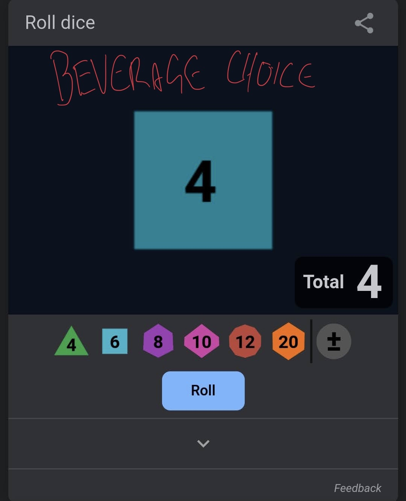
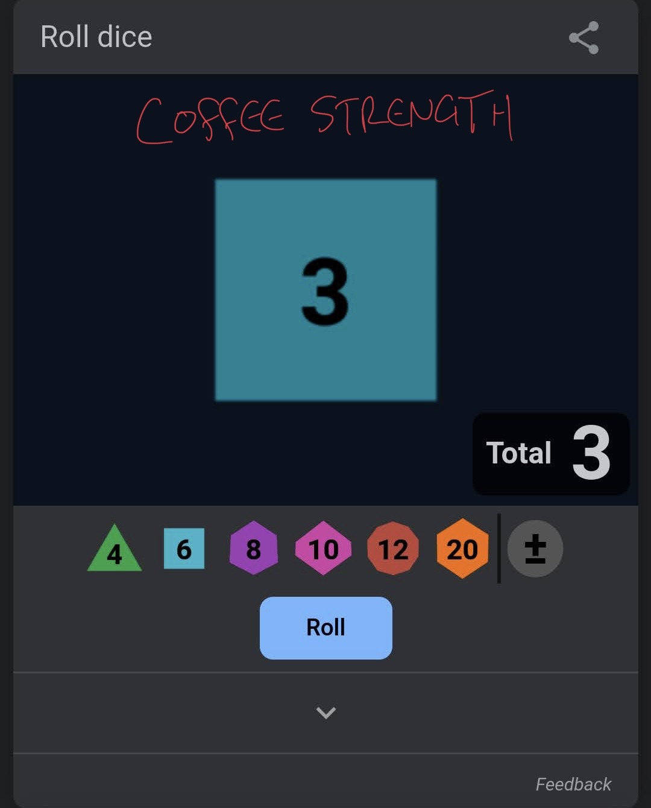
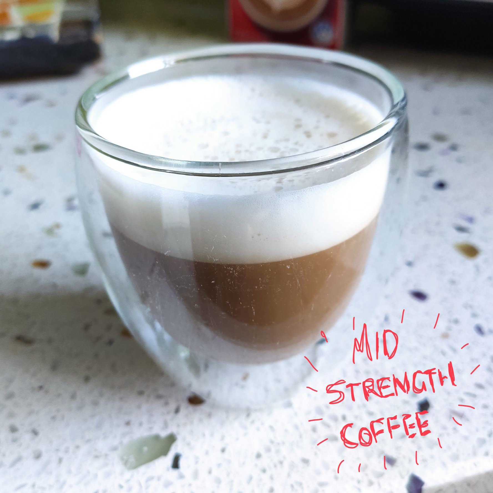
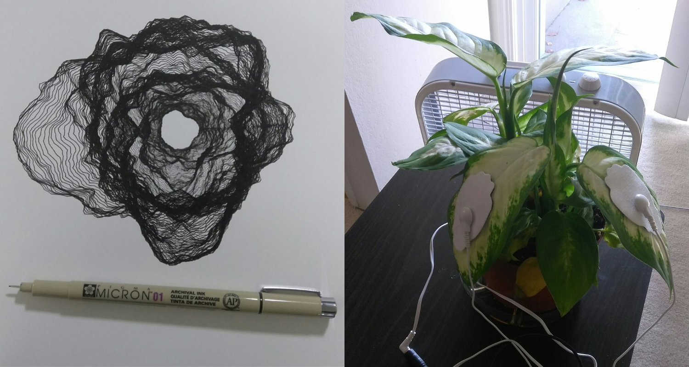
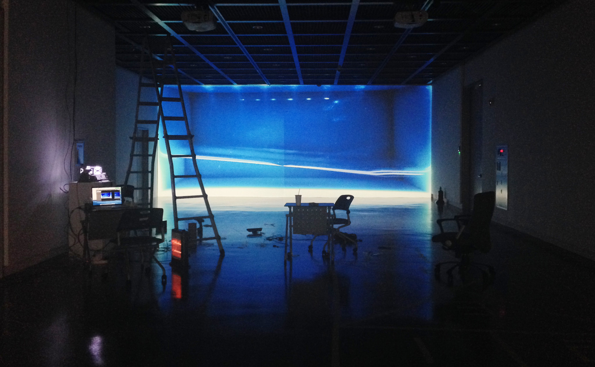

# week 2

## 12 hour challenge 

The first 'self-algorithm' I tried involved what would normally be my morning coffee, except that I included five other options to be determined by a dice roll. Luckily for me, I rolled a four which was the coffee option. I then used a dice again to determine thhe strength of the coffee. I'm definitely someone who prefers their coffee strong so I was disappointed to only roll a three :(. A follow-up coffee was much needed.

I spent this week researching more generative works and examples, and I found I was more drawn to some interactive, physical works, not necessarily involving a computer screen. The first examples I looked at involved what were essentially [drawing robots](https://www.instructables.com/How-to-make-an-Artbot/), and while they were pretty cool, I thought that the result would not be very impacful, even if some sort of dataset could be used as an input, the input would not be particularly obvious. I then found another project by [Robbie Barrat](https://github.com/robbiebarrat/plant-art/blob/master/README.md) that was also essentially just a drawing machine using a pen plotter, however his tapped into the energy that plants naturally emit in order to draw some organic shapes. I found this project really interesting because I really wasn't aware of this method of recording energy outputs of plants, and I found the result really mesmerising. 

The work I found that really grabbed me the most was ['May the Force Be With You'](https://vimeo.com/88422606) by Teo Park (which was nominated for a number of awards). His work uses a Kinect sensor to record someone's gestures, which are able to control a projection of water. I found the method of projection really interesting as he did not project a digital image, rather using a motorised container of water with a projector light behind it. I found the result, accompanied with the music, really moving and the interactivity was very engaging. 

All these kinds of generative works would require a number of hardware pieces to function, like kinect sensors, Arduinos, Raspberry Pi, etc, which I would be open to, however given we are all stuck at home, the final output would be limited to what can be shown over a screen, which will definitely effect the direction I go.

## hour of code 

We began trying out some basic code in the Processing program in order to achieve some basic interactive sketches. I found it to be pretty perplexing to begin with, because I'd only ever had basic experience with HTML and CSS so this was quite different. The results were being able to draw using shapes in the sketch, by following the mouse position. We also used the mouse position to determine the colour.

I also remixed Jinni's sketch, adding mouse-tracking animated facial expression, as well as changing hair colour based on the mouse location.

## [week 3 ->](https://sylvain-girard.github.io/Slave2theAlgo2020/week03/)

### [home](https://sylvain-girard.github.io/Slave2theAlgo2020/landing-page/s2tapage/)
