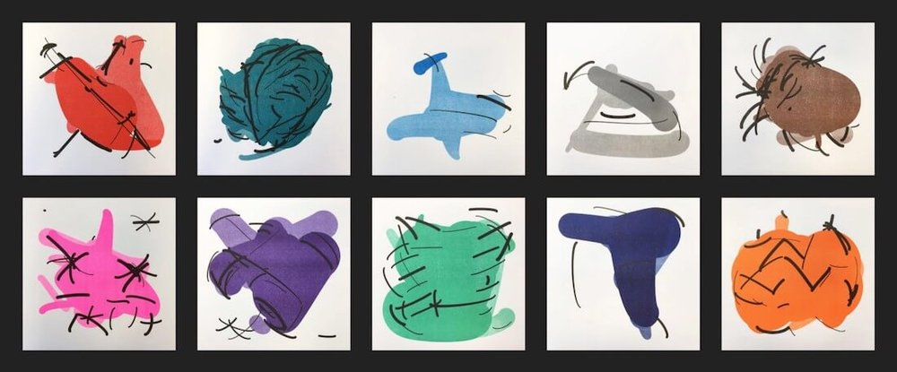
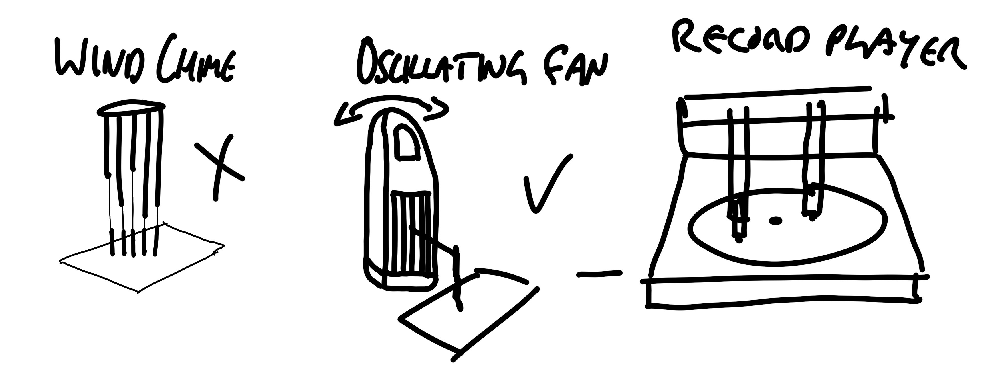

# week 3

## 12 hour challenge 

This week my '12 hour challenge' involved finding new international music, which is something that I do on a regular basis. Instead of using a dice this time, because I had a wider array of parameters, I used a random number generator. For the first parameter I used a range of 1-20 to choose from the 20 most common languages. I got a 13 which was Japanese, I then entered a range of 1-8 to select the genre. The options were a little biased here as I cose genres that I actually listen to in the hooe that the result would be something I'd actually like to listen to. The result was number 8, being Punk, and from their I searched 'Japanese Punk' and took the 9 bands on the suggested results as the final parameters. I got number 1, so the result was the band 'The Stalin', and I started to listen to some of their music. I added a few of their songs to my playlist so I guess you could say the experiment was a success. 

## weekly research

This week I was looking into generative art, just to kind of get an idea of what kind of outcomes may be produced using primarily raw data as an input. I came across the work of [Tom White](https://aiartists.org/tom-white), who uses machine learning and neural networks to turn the systems used by Google, Amazon, for classifying the content of an image, into systems that can output images based on these parameters. The visual result is basically the essence of whatever thing is depicted, from the perspective of machines. Sometimes the result can be deciphered by a human mind, sometimes its just too abstract, but for these systems it is the most refined example.

## basic drawing machines

We moved on to more mechanical apporaches to generative design, being drawing machines. I started with a few sketches of what I thought could work as a drawing machine. On this day there happened to be no wind so I skipped this idea. I first set up the oscillating fan drawing machine by attaching a rod and string to it, and a 'sail' to catch some of the wind too. The result was interesting but a little predictable. I then used a record player and two pens hanging from its lid to achieve a different method. The result of this method was a lot more interesting because the movement was a bit more erratic, though still not unexpected. I think adding multiple rotations and intermission would make it a lot more interesting as it reaches a level that the human mind cannot anticipate so easily.

### Record player machine

### Oscillating fan machine

## [week 4 ->](https://sylvain-girard.github.io/Slave2theAlgo2020/week04/)
