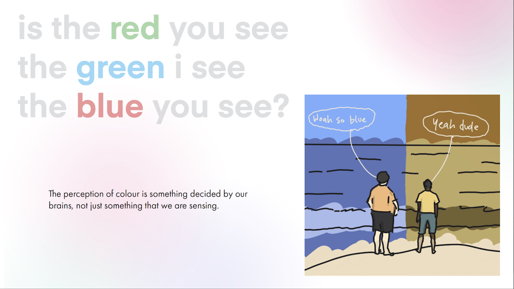

# week 5

## pitch

In week 5 we all presented our pitches for our projects. My [Pitch](https://docs.google.com/presentation/d/e/2PACX-1vQyI2gfDF_hBUyya5y3rlEMoUVXuZHGCvwTR4Or96Hbf7ZHkhX3xWyuK5WMICxYi2Q5YAmAYaamJxwL/pub?start=false&loop=false&delayms=30000&slide=id.p) was focusing on Chromaesthesia and ways that this could be represented with an interactive web format. Essentially I plan to create a sort of visualiser, however it uses the various properties of sound as parameters for a number of visual reactions. Much like a person with chromaesthesia sees a specific colour for music notes. One of my stretch goals was to do this almost in reverse, being able to create sounds or music from an image. Karen reminded me of a man (?), [Neil Harbisson](https://www.youtube.com/watch?v=C_OnYqx3ynA), the world's first cyborg, who uses an implant to be able to 'hear colours', which encompasses what I'd like to do quite well.

## weekly research

Most of my research this week was actually surrounding the philosophy of colour, synaesthesia and chromaesthesia, and how exactly colours can be connected to sound. I've often thought about the fact that we don't really have any way of confirming that the colours we see are the same as everyone else sees, it's something we just assume. After conducting some research I came across [this article](https://www.livescience.com/21275-color-red-blue-scientists.html) that discusses the topic of humans seeing colours differently, as well as being able to see new colours. The same kind of phenomena would exist with synaesthesia I would imagine; it's not something that is easily explained as it exists in an individual perception. In my pitch I also mention the work of Carsten Nicolai, particuarly his piece [reflektor distortion](http://www.carstennicolai.com/?c=works&w=reflektor_distortion) that uses sound waves to effect a surface of water, and lights to show this affect on the surface of the water. The concept can be related to my own idea, though Carsten's utilises a somewhat more 'analogue' approach to visualising the sound, which is more limited, but very visually effective.

## [week 6 ->](https://sylvain-girard.github.io/Slave2theAlgo2020/week06/)

### [home](https://sylvain-girard.github.io/Slave2theAlgo2020/landing-page/s2tapage/)
