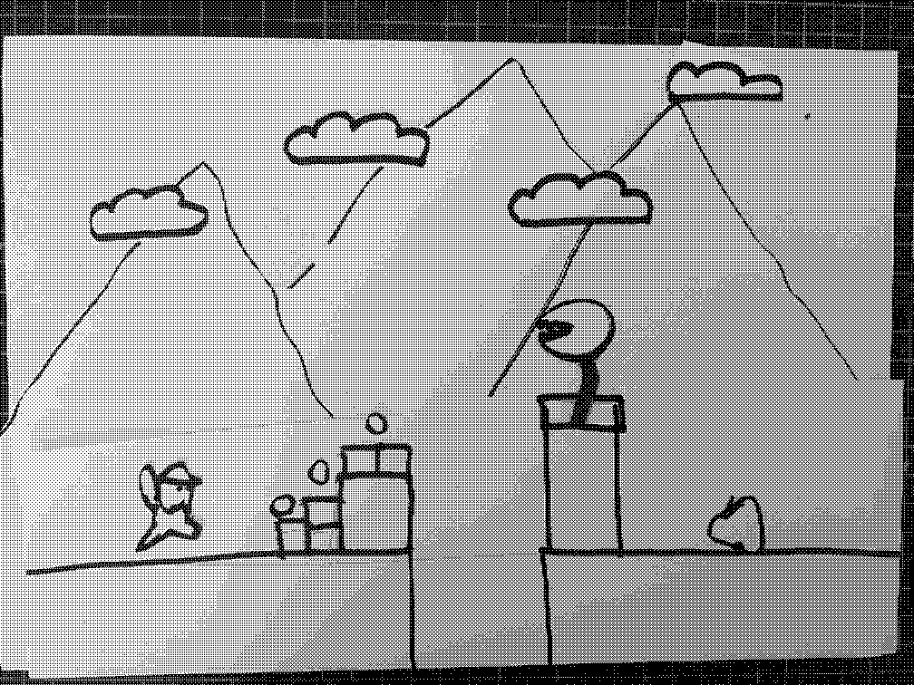

# week 6

## paper prototype

This was a task to get us thinking about how to present our ideas in a really quick way without spending too much time obsessing over details. This is an example of a paper prototype of Super Mario. I tried to show as much of the detail as I can remember of the game, like the scrolling background, coins, enemies, etc. It was then converted into a GIF in Photoshop, which I think is a good way of creating a really strong representation of an animated piece or interactive work. From here I will try to create one from my own project, though it may be slightly different given the input is dynamic sound data with endless different possibilities.

## hour of code

This was the first time we started to work with sound in Processing to create a sort of volume-based visualiser. This is something that relates closely to something I would like to create and I was surprised how sound can be integrated with P5js. I think I will try to experiement with how 'severe' the amplitude effects the circles so it can appear a bit smoother. After this introduction to p5 Sound, I made the decision to stick with processing for creating my project. Up until now I wasn't sure if it would be sufficient for what I need, or if another program like Touch designer might be more suitable, but given that I would want it to be available on the web, and how user-friendly p5 Sound in p5js seems, I will stick with that.

## my own paper prototype

After the class I created a paper prototype of the functions and basic look of what I imagined my work to be. It was actually quite helpful in understanding how to plan out my work, after having thhat introduction into p5 Sound earlier thhat day. I'm still not exactly sure as to the extent of p5 Sound's capabilities, but I plan to research all of that over the next week.

## [week 7 ->](https://sylvain-girard.github.io/Slave2theAlgo2020/week07/)

### [home](https://sylvain-girard.github.io/Slave2theAlgo2020/landing-page/s2tapage/)
