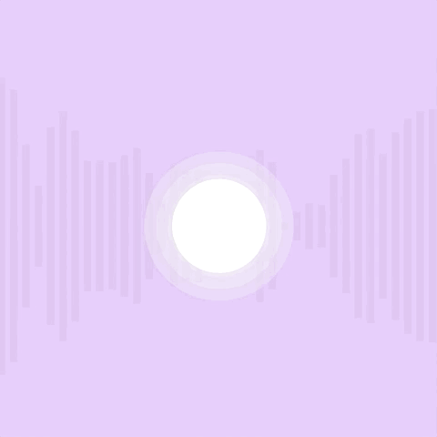

# week 7

## working on my project

This was a small development on the week 6 task. I was just playing around with getting multiple shapes driven by the amplitude at different factors. I found that just multiplying the value of the amplitude wasn't resulting in the effect I imagined, so I will keep trying different ways.

This was just an example of using FFT (frequency) to drive some shapes. I watched a lot of Daniel Shiffman's videos on the subject as well as reading the information in the p5Js sound guide. From here it is just a matter of extracting various sectors of the frequecy so I can use it to represent bass and treble, and affect some other visual elements.

## weekly coding

This week involved some more type-based coding and being able to assign various effects to words or letters. Towards the end we also went over assigning key commands from the keyboard, whichh was easier than I expected. The result was being able to write text that moves around randomly and over time could eventually become illegible.

## [week 8 ->](https://sylvain-girard.github.io/Slave2theAlgo2020/week08/)
