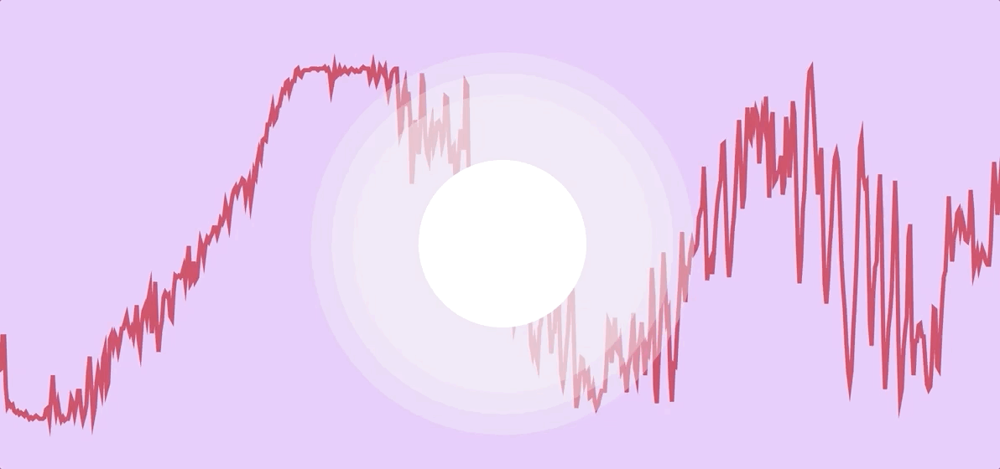

# week 8

## pseudocode

Pseudocode is a way of planning out real code in plain English, and potentially to use as a guide for writing the real code. I think of it as writing the English phonetic pronunciation when you're learning a new language, before writing the proper spelling; it helps you bridge the learning gap and make it easier to remember.
As my code will rely largely on numerical data pulled from sound rather than user input, I found it pretty hard to plan out the pseudocode for my project, so I left it quite abstract as to not spend too much time on it and get going on my real code.

FUNCTION visual

INPUT sound

IF sound plays
	analyse (high, mid, low),
(high+mid+low)

ELSE IF

Map waveform

Map amplitude

Map frequencies

ELSE IF

Translate shapes

Scale shapes 

ELSE IF

change colours

WHILE sound plays

IF keyPressed

sound stop

END IF

## my code progress

Waveform is another function of p5sound that, which as the name would suggest, taps into the waveform of the sound file. It was surprisingly simple to get it running on my original sketch, however what I need is similar to a waveform, though mapped to a semi-circle rather than a flat line. From my attempts, I found this would not be that simple, but I have no doubt that it is possible. I may revisit it after I get all of my inputs going in my sketch.

I spent a while researching FFT and trying to find other examples of visualers or sound driven sketches using p5js. I found a couple of very useful examples by [Tympanus](https://tympanus.net/codrops/2018/03/06/creative-audio-visualizers/) and [Rios](https://editor.p5js.org/rios/sketches) with codes using the getEnergy function of p5sound. With this information I finally managed to get my own sketch up and running. The main difficulties arose from knowing where to place all the variables, I originally had them all outisde of 'function draw' but after trying everything I found that they should be within 'function draw' entirely. I'm sure there is a neater way to do it but I am just happy that it works. My code uses five variables from the sound, bass, low mid, mid, high mid, and treble.

Tympanus

Bass, low mid, mid, high mid, treble

This is just a start on trying to get the sound values to move shapes and change colours, rather than just control the scale. So far I am still not sure how I will achieve the wavy lines that I am aiming for, as the 'waveform' function that I had been working on seems to be tied to require a flat line (x-axis or y-axis). Right now the colours are not being effected as much as I need, but I still have a lot to explore in that department.

## hour of code

I was super surprised at how quick the process was for creating a basic text-to-speech function in p5js (for an experienced coder of course). The text-to-speech results using the p5speech library were also much more accurate than I would have expected them to be. While I may not use this in my project, I can see it being very useful for future reference when showcasing a typeface, or pretty much endless other possibilities. After class I attempted to make a multilingual version tat could detect me speaking other languages than English, however it appeared that regardless of what language is called in the code, the language that it listens for is determined by your browser language, with English as a base default too. Unfortunately I couldn't get it working without English, just using the browser language. I was surprised though at how well it can determine which language you are speaking, even when alternating languages word by word. I will definitely revisit this at a later date.

## [week 9 ->](https://sylvain-girard.github.io/Slave2theAlgo2020/week09/)

### [home](https://sylvain-girard.github.io/Slave2theAlgo2020/landing-page/s2tapage/)
