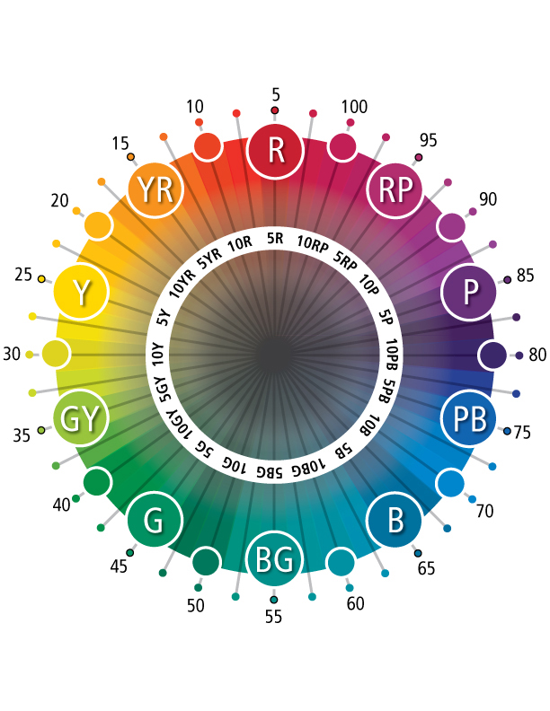
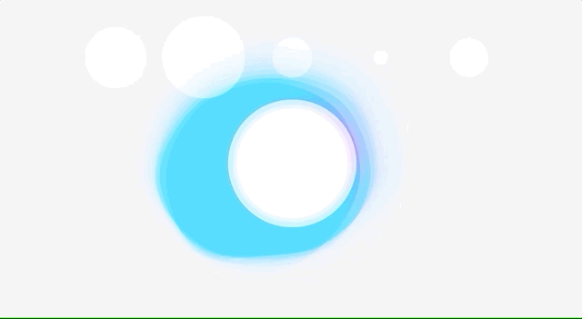
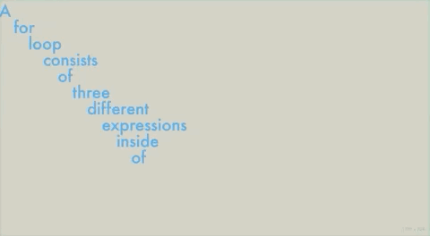

# week 9

## continuing my code

At this stage I am working towards combining all my p5 sketches into the single, final sketch. Not all the elements are functioning perfectly yet, particularly the wavy lines that I want, but I will work on them as I go. Combining everything is proving to be a bit of a process, as I need to make sure all of the variables are called at the right stage; some only work when called in the draw function, and some should be called first or in the setup. I've also been converting everything into the HSB colour mode, so that I can map the colour to the frequencies in a more natural way, controlling the hue, saturation, and brightness as separate variables. I've never really worked with HSB before, so I needed to print off a hue circle as a reference for getting my colours right.

The five circles at the top are just left in to monitor what all the frequencies are doing in different songs.

## hour of code

This week's coding session was particularly focused on typography and while it may not be useful for my project now, I'm already thinking of many future projects that could be done with these techniques. The below code is able to take a string of text and separate it into individual words that appear in time with the framecount. If the mouse goes close to the left of the window the words start to 'vibrate' within a random range. I like the effect of having some clean text that then becomes illegible when it starts to shake.

## text to points

After the vibrating letters sketch we looked at the text-to-points function of p5js that allows the extrapolation of the vertex points of a letterform. I thought it was cool how you can essentially map a sin wave onto a letter, then Karen gave me the idea that I could use a letter O as a basis for the wavy lines in my sketch. I had been playing around with a sin wave on a circle, but given thhat the points are evenly spaced around the circle, it looked a bit too uniform.

## [week 10 ->](https://sylvain-girard.github.io/Slave2theAlgo2020/week10/)
