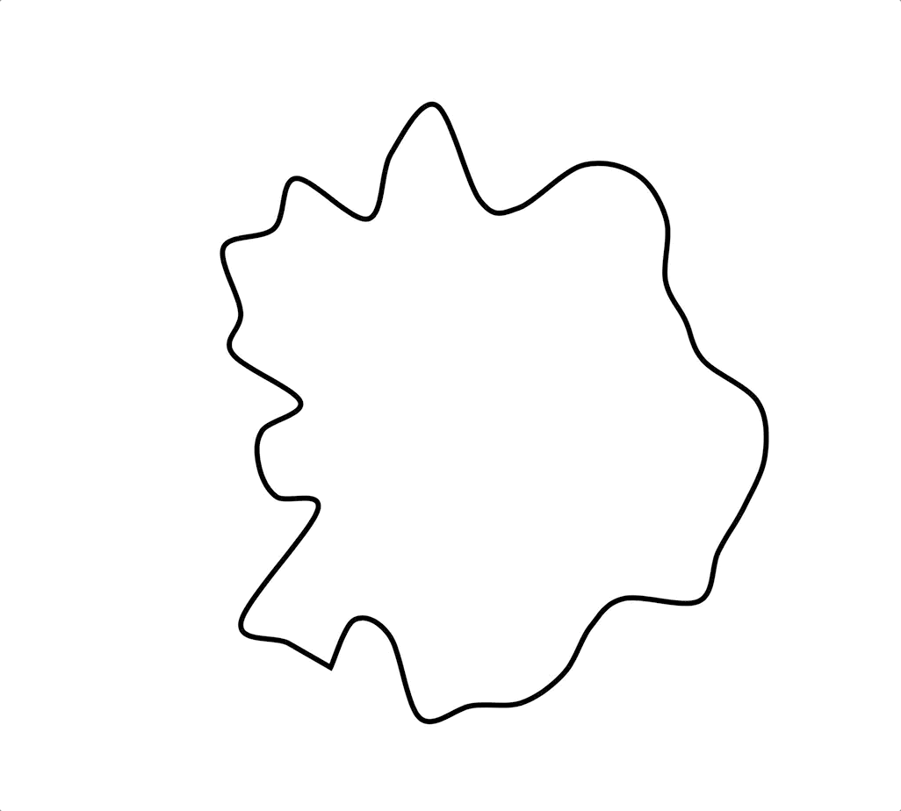

# Week 11

[Another attempt](https://sylvain-girard.github.io/Slave2theAlgo2020/week11/noiselines/) (space bar to start) at finding the right method to create the organic wavy lines I want in my sketch. This time I tried something similar to the simple sin wave effected circle, but this time, adding noise as a factor too. This got rid of a lot of that uniformity that I didn't want, but maybe too much so, as the result was a bit too erratic.

Sin wave circle vs sin wave with noise

Not being 100% happy with either of these methods, I revisited the text to points method that was looking a lot better. It took me a while to realise that I need to work backwards and get it to be at the right size and rotation that I need, before adding to the original translation to get it exactly in the centre. I had to divide the text bounds by some fraction of the screen width and height, meaning that it will only be responsive to a certain degree (not working on phones). This is not ideal but I think it's a small sacrific to make for getting the right effect I want.

At this point in the project I was encountering many difficulties with the deadline looming. Naturally, when combining the sketch of an individual element into the main sketch with hundreds of lines of code, there will be some difficulty with making sure all the variables are there, there are no conflicting variables, everything of that nature. I couldn't figure out why my wavy lines were working fine in their own sketch, but not in my main sketch. I started commenting out lines one by one and realised that I had made a mistake by calling the angle mode at the start rather than in set-up. From here on, the process was somewhat smooth-sailing.

## UI

After this, I focused on the user interaction elements with the sketch. I knew that I still had work to do on the visuals themselves, but I also knew that the UI was important and I didn't want to leave it until the last minute. The way I added buttons was a bit of a cheat method to be honest... I used CSS elements within the p5 sketch, made sure the shape and position was right, then just gave them 0 opacity. This was the best way I could think of for adding buttons that fit my design (having a big circle as a button in the middle), and are still pretty easy to connect to hover and click events. In those events, I just added changes in the text opacity over the CSS buttons to give them that 'clickable-ness'.

[Sketch as of week 11 (showing angle mode issue)](https://sylvain-girard.github.io/Slave2theAlgo2020/week11/chromaesthetorweek11/)

## [week 12 ->](https://sylvain-girard.github.io/Slave2theAlgo2020/week12/)

### [home](https://sylvain-girard.github.io/Slave2theAlgo2020/landing-page/s2tapage/)
