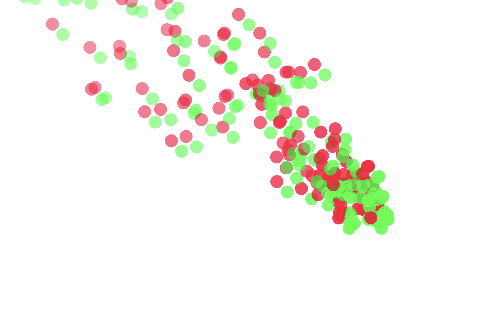
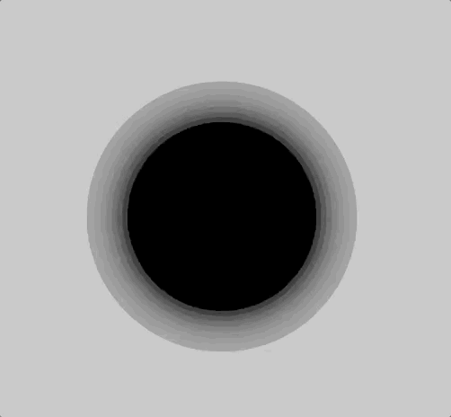
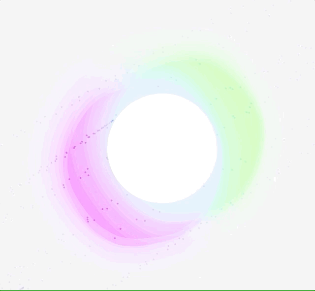
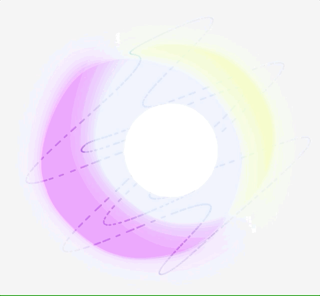

## Week 12

This was defintely one of the busier weeks to say the least... While my project was coming together relatively as I imagined, I was held back by a few things that I hadn't yet considered. For starters, I originally had a couple of elements in my sketch, such as a particle burst upon beat detection, that were really impairing the overall sketch. While they looked cool and were part of my original idea, they were causing a quite a lot of jumpiness and lag in the sketch, which really ruined the experience as the visuals couldn't keep up with the sound. I decided that the visuals I had were enough, so I replaced the particles with another circle in the middle the detects beats and shrinks between beats. I think this was actually pretty effective.

I moved on to finalising the the wavy lines that had been causing me so much trouble... I still had an issue with there being a connecting line at the top of the letter O that kind of ruined it, so I experiemented with all the different ways of using [beginShape](https://p5js.org/reference/#/p5/beginShape). I found that if I called any variable in the beginShape() brackets, that line would disappear, so I left in on beginShape(POINTS) because I liked the effect. After working on the sound mapping of the lines and getting it to a place that I liked, I was finding that, at times, the points were just turning into a mess of dots on the screen and losing thhe line form, so I switched to beginShape(LINES). This worked really well with the sound; as the lines expanded, they appeared to gain speed because the space between them would grow too.

Connecting line issue

BeginShape(POINTS)

BeginShape(LINES)

Throughout my testing, I had only been using a couple of different songs to test the visual reactions in the sketch, so while the result was great for these songs, I found that once I got the upload functionality working properly and starting trying many different songs, the result was less than satisfactory. This is because I had been tuning the visuals to work well with specific songs, but every song has different qualities that would effect the visuals differently. For example, I found some songs were having the colours stay in the same range throughout the whole song, which is not ideal, so I changed the way colours were mapped. I had originally been using a complicated mapping system based on the 360 degrees of colour hues with a selected range for bass and negtive range for treble. I realised that 99% of the time in music, the treble and bass would never be at the same level, so for a more accurate effect, I could actually just give them the same mapping range of 0-360. This produced a much better result.

The very last thing I did was add a dark mode to the Chromaeshetor. This was something I planned to do if I had enough time at the end because it wasn't really just a matter of chnaging the background. I had to figure out a way that would allow me to set up a button with a boolean operation and toggle various changes. The dark mode involves a darker background, of course, darker centre circles with adjusted opacity, changed blend modes for the sin wave lines and blobs, then the blobs themselves and the lines had colours and opacity adjusted. I didn't want the colours to be exactly the same in the dark mode, just on a dark background, so the colours in the dark mode are a bit more focused on oranges and blues. 

The final sketch of the [Chromaesthetor](https://sylvain-girard.github.io/Slave2theAlgo2020/week12/Chromaesthetor/). As of submission it's working well on desktops, laptops, and tablets, however not on screens with a very different aspect ratio (phones).
