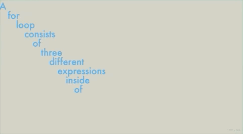

# week 8

## hour of code

This week's coding session was particularly focused on typography and while it may not be useful for my project now, I'm already thinking of many future projects that could be done with these techniques. The below code is able to take a string of text and separate it into individual words that appear in time with the framecount. If the mouse goes close to the left of the window the words start to 'vibrate' within a random range. I like the effect of having some clean text that then becomes illegible when it starts to shake.

